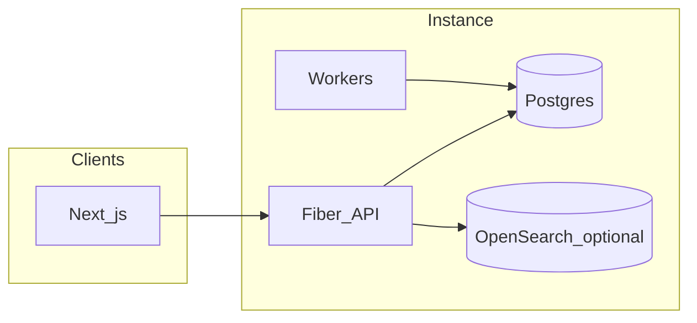

# Architecture overview (self-hosted)

This is a **Markdown-friendly** summary. Older exports may exist as RTF-wrapped files in the same folder.

## Stance

- **Modular monolith**: one primary API process (`apps/api`) with clear internal packages (`identity_access`, `knowledge_core`, `ingestion_connectors`, `search`, `governance`, …).
- **Separate worker process** (`apps/api/cmd/jobworker`) for asynchronous work (same module as the API).
- **Next.js** admin and user shell (`apps/web`).
- **PostgreSQL** as the source of truth; optional **OpenSearch** for governed full-text search with domain filters.

## Data flow (simplified)

## Principles (non-negotiable)

1. **Access before retrieval** — scope is resolved from grants before search/LLM context assembly.
2. **Knowledge objects over raw files** — entities carry lifecycle, trust, and provenance.
3. **Auditability** — sensitive mutations emit audit events.
4. **Governance** — derived and high-impact outputs can require review before publication.

## Deployment unit

One running stack **per organization** (your instance). Multi-tenant SaaS is not assumed in the core design.

Some older files under `docs/` may still be **RTF-wrapped** exports. Prefer this file, [ARCHITECTURE.md](./ARCHITECTURE.md), and [CONFIG_ENV.md](./CONFIG_ENV.md) for readable GitHub viewing until those are normalized.

## Related

- [SELF_HOSTED.md](./SELF_HOSTED.md)
- ADRs in [docs/adr/](./adr/)
- [ACCESS_MODEL.md](./ACCESS_MODEL.md), [DOMAIN_MODEL.md](./DOMAIN_MODEL.md)

