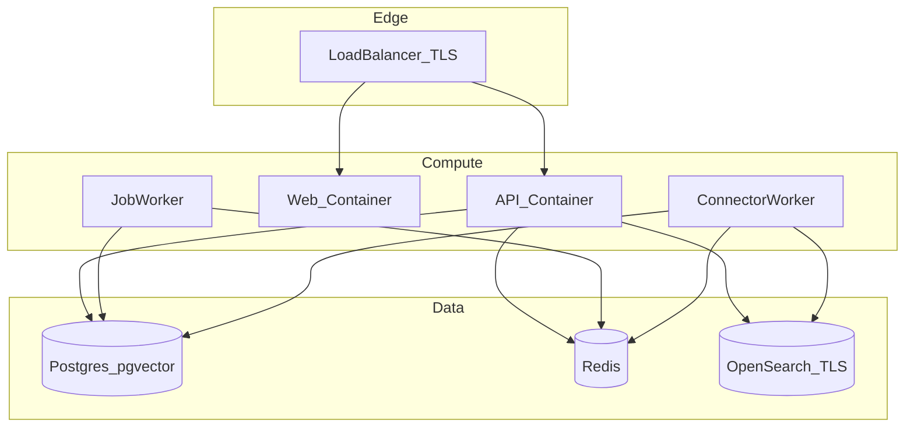

# DigitalOcean infrastructure topology

Reference **topology** for a production-style deployment (not mandatory—adapt to your scale).

## Notes

- **API** and **web** terminate TLS at the load balancer or platform edge; set `APP_PUBLIC_URL` and cookie flags per [PRODUCTION_HARDENING.md](PRODUCTION_HARDENING.md).
- **Workers** are separate processes (same image, different command) sharing `DATABASE_URL`, `REDIS_URL`, and OpenSearch settings.
- **OpenSearch**: use a secured cluster (TLS + auth); do not reuse local compose’s security-disabled profile.

## Related

- [DO_DEPLOYMENT.md](DO_DEPLOYMENT.md)
- [deploy/do/README.md](../deploy/do/README.md)
