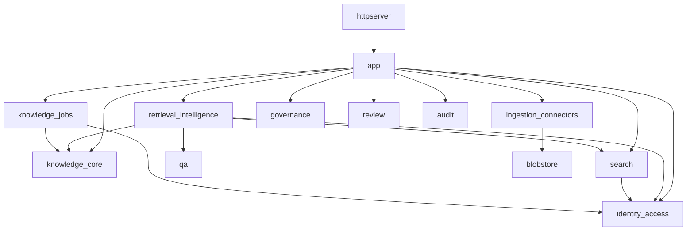
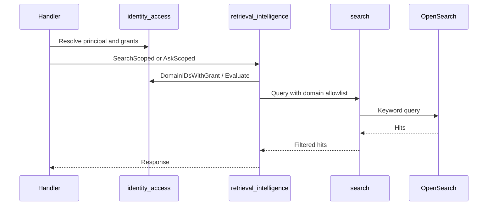
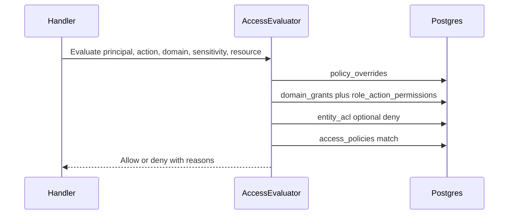
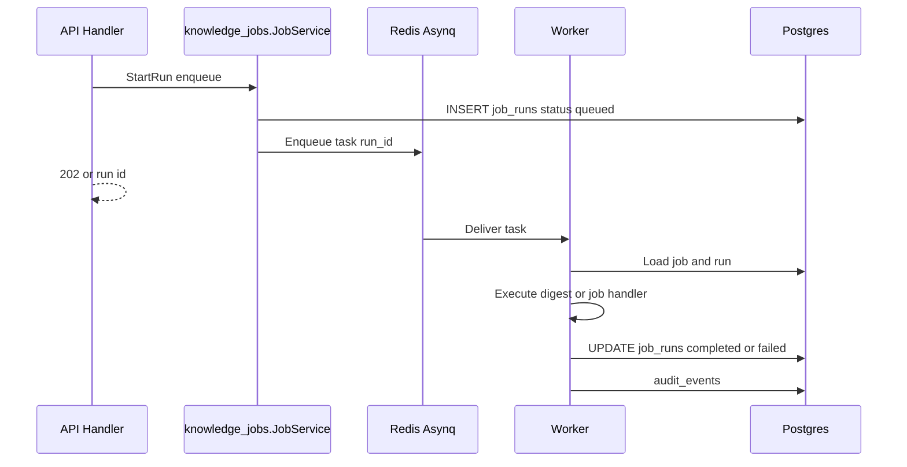
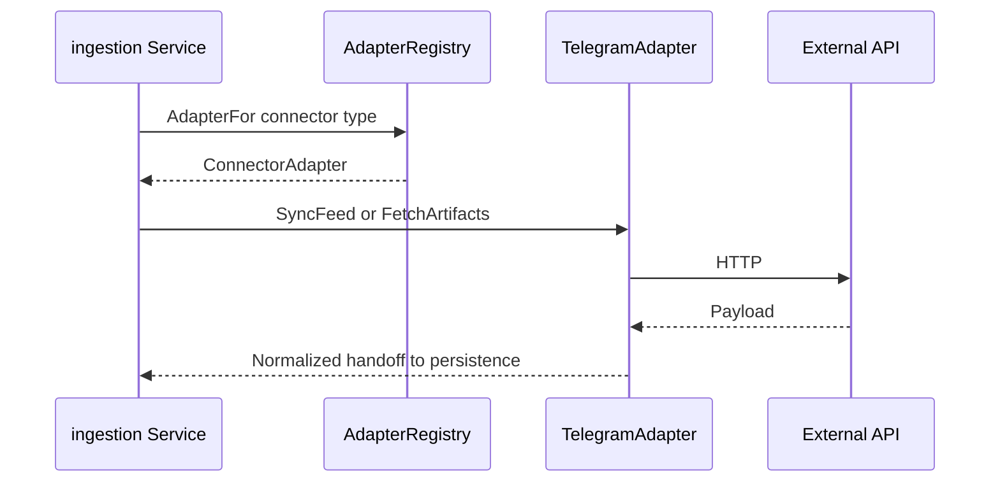

# Module boundaries and dependency rules

This document is the structural contract for the Go modular monolith (`apps/api`). It complements [ARCHITECTURE.md](./ARCHITECTURE.md) and [backend-architecture.md](./backend-architecture.md) (platform vs `modules/*`, workers, dependency rules) with an explicit **module map**, **allowed import edges**, and **core flows**.

## 1. Bounded contexts (backend packages)

| Context                | Package path                                                                                   | Responsibility                                                                                                    |
| ---------------------- | ---------------------------------------------------------------------------------------------- | ----------------------------------------------------------------------------------------------------------------- |
| identity_access        | `internal/identity_access`                                                                     | Users, teams, roles, domains, grants, permission resolution, sensitivity caps, policy overrides, entity ACL hooks |
| knowledge_core         | `internal/knowledge_core`                                                                      | Canonical entities, payloads, versions, links, provenance persistence                                             |
| ingestion_connectors   | `internal/ingestion_connectors`                                                                | Connectors, source feeds, sync orchestration, raw artifacts, adapter registry                                     |
| knowledge_jobs         | `internal/knowledge_jobs`                                                                      | Job definitions, triggers, runs, outputs, enqueue for async execution                                             |
| retrieval_intelligence | `internal/retrieval_intelligence`                                                              | Permission-aware retrieval façade, ask orchestration (delegates to search, qa, answertrace)                       |
| governance             | `internal/governance`                                                                          | Policy exceptions, owners, approval queue, stale content, answer feedback                                         |
| review                 | `internal/review`                                                                              | Review tasks CRUD and workflow steps                                                                              |
| audit_ops              | `internal/audit` (pilot: `internal/modules/audit_ops`)                                         | Append-only audit events; transport extraction under `modules/audit_ops/transport`                                |
| search                 | `internal/search`                                                                              | Keyword / OpenSearch indexing and queries (must respect scoped domains from identity_access)                      |
| qa                     | `internal/qa`                                                                                  | LLM synthesis from evidence entities (called only via retrieval_intelligence in transport)                        |
| platform               | `internal/platform/`*, `internal/httpserver`, `internal/app`, `internal/config`, `internal/db` | Permissions façade, queue, composition, HTTP transport, wiring                                                    |

### 1.1 Platform and supporting packages (not separate bounded contexts)

These directories under `internal/` support the contexts above. **Do not** treat them as free-standing domains; extend them only when a flow in §2 already touches them. Avoid new import edges into `identity_access` from retrieval or ingestion except via existing patterns.

| Area                  | Package path                                         | Responsibility                                                                                     |
| --------------------- | ---------------------------------------------------- | -------------------------------------------------------------------------------------------------- |
| Retrieval composition | `internal/retrieval`                                 | Hybrid retrieval orchestration used by `retrieval_intelligence` (search + embeddings + LLM client) |
| Embeddings            | `internal/embeddings`                                | Chunk embeddings, semantic near queries (permission-filtered via `permissions.Resolver`)           |
| Chunking              | `internal/chunks`                                    | Entity chunk lifecycle for embeddings / retrieval                                                  |
| Answer traces         | `internal/answertrace`                               | Persisted Ask traces                                                                               |
| LLM client            | `internal/llm`                                       | OpenAI (and mock) client construction from env                                                     |
| AI privacy            | `internal/ai/privacy`                                | Policy, sanitize, vault, rehydrate gateway for governed completions                                |
| Content assembly      | `internal/contenthub`, `internal/contentblocks`      | Structured content surfaces                                                                        |
| Surfacing             | `internal/surfacing`                                 | Follow / feed persistence                                                                          |
| Home                  | `internal/home`                                      | Home feed builder                                                                                  |
| OpenSearch            | `internal/opensearch`                                | Search backend client                                                                              |
| Builders              | `internal/role_builder`, `internal/scenario_builder` | Role/scenario definitions and `PrincipalAllowsScenario` data                                       |
| Onboarding            | `internal/onboarding`, `internal/presetcatalog`      | Setup sessions and preset catalog bundles                                                          |
| Blob storage          | `internal/blobstore`                                 | S3-compatible or Nop raw storage                                                                   |
| Auth / request        | `internal/auth`, `internal/httpcontext`              | Session auth helpers and principal extraction                                                      |

Earlier drafts of this document mentioned placeholder packages `platform_operations`, `workflow_governance`, and `events` as reserved seams. They were removed in Phase 1 alignment because pure `doc.go`-only packages add navigation noise without enforcing any constraint; the same naming reservation can be reintroduced when a real module needs the seam.

## 2. Allowed dependency direction (no cycles)

**Rules**

- `identity_access` must not import `knowledge_core`, `search`, `qa`, or `ingestion_connectors`.
- `knowledge_core` must not import `httpserver`, `qa`, or `search`.
- `retrieval_intelligence` may import `identity_access`, `knowledge_core`, `search`, `qa`, `answertrace`, `llm` — it is the composition root for read/ask paths.
- `search` may import `identity_access` only for **grant listing / policy resolution** (no duplication of grant SQL outside `identity_access` helpers).
- `ingestion_connectors` uses **connector adapters** under `internal/ingestion_connectors/adapters/`; adapters must not import `httpserver`.

## 3. Layering inside a context

For each bounded context, prefer:

1. **Transport** — Fiber handlers (thin): parse, call application service, map status.
2. **Application** — orchestration, transactions across repos, enqueue workers.
3. **Domain** — invariants, pure types (small structs, validation).
4. **Repository** — SQL / store I/O only.

Handlers must not contain ad-hoc SQL; repositories must not decide authorization (callers pass principal or pre-checked scope).

## 4. Request flow (authenticated read)

## 5. Permission flow (entity view)

## 6. Async processing flow (knowledge job run)

## 7. Connector adapter flow

## 8. When to update this doc

Update when: adding a new top-level `internal/*` package, changing allowed imports, introducing a new queue or storage adapter, or moving ask/search entry points.

## 9. `internal/modules` (hexagonal pilot) vs flat `internal/*`

A small **pilot** lives under `internal/modules/` (e.g. `audit_ops` with transport extraction). **Default for new work** remains flat bounded-context packages under `internal/<context>/` per this document. Whether to grow the pilot or fold it back is governed by [ADR-0011](./adr/0011-internal-modules-pilot-scope.md).

### 9.1 Pilot freeze (alignment period)

Until **control-plane URL parity** advances (no new reliance on dash-only admin for primary operator flows — see [ADMIN_UI_CONSOLIDATION_PLAN.md](./ADMIN_UI_CONSOLIDATION_PLAN.md) §7 Phase 4 exit criteria) **and** [OSS_V1_SCOPE.md](./OSS_V1_SCOPE.md) stays current:

- **Do not** introduce **new** top-level pilots under `internal/modules/*` beyond what ADR-0011 already lists.
- **Do** ship new domains and features under flat `internal/<context>/` only; extend existing `modules/*` pilots only for regressions or security fixes.
- Revisit this freeze when ADR-0011 is superseded or explicitly closed out.