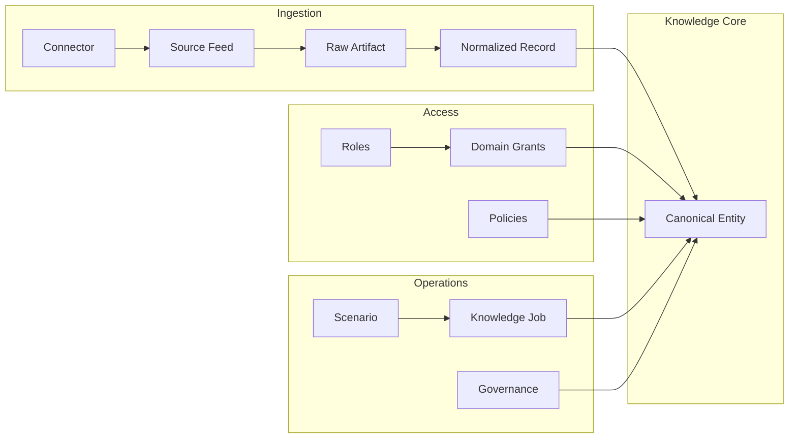

# Product concepts

What the platform **is** and how the main ideas fit together. For term definitions, see [GLOSSARY.md](GLOSSARY.md).

## What this product is

An **organizational memory** system: not a generic chatbot over files, not a document dump, not a collaboration replacement. It provides:

1. **Controlled ingestion** — connectors and **source feeds** bring data in with policy.
2. **Governed knowledge objects** — **canonical entities** with lifecycle, truth mode, and sensitivity.
3. **Permission-aware retrieval** — search and ask only within **granted domains** and rules.
4. **AI-assisted synthesis with citations** — **Ask** uses permitted context; outputs can be governed.

## How pieces connect

## Control plane vs product surface

- **Control plane** — admins configure **roles**, **scenarios**, **jobs**, **sources**, **presets**, and **setup**.
- **User-facing surface** — **search**, **ask**, **explorer**, **digests**, **projects**, **decisions** — always subject to the same permission engine.

## Truth and authority

The platform distinguishes **canonical** platform truth, **mirrored** external authority, and **derived** artifacts that may require review (see [DOMAIN_MODEL.md](DOMAIN_MODEL.md) and ADRs on truth classification).

## Where to read next

- [USER_GUIDE.md](USER_GUIDE.md) — scenarios for people using the product.
- [CONTROL_PLANE_OVERVIEW.md](CONTROL_PLANE_OVERVIEW.md) — admin configuration map.
- [ARCHITECTURE.md](ARCHITECTURE.md) — technical structure.
