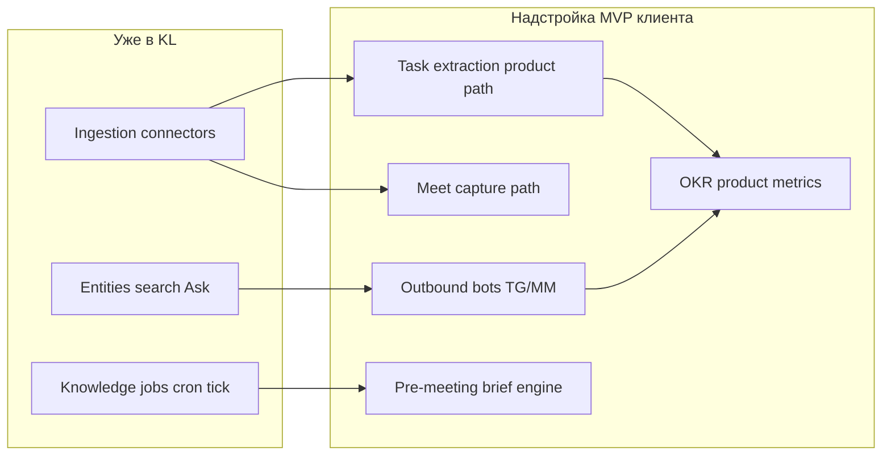

# Second Brain overlay sizing (поверх Knowledge Layer)

**Purpose:** порядок величин **надстройки** для сценария «AI Second Brain» клиента, если данные и доступ моделируются **внутри KL** (домены, сущности, коннекторы, `POST /ask`, governance). Это не календарь спринтов клиента и не договор о фиксированной цене.

**Связанные документы:** [SECOND_BRAIN_CLIENT_GAP_MATRIX.md](./SECOND_BRAIN_CLIENT_GAP_MATRIX.md), [EXTRACTED_MEETING_TASKS.md](./EXTRACTED_MEETING_TASKS.md), [CONNECTOR_CAPABILITY_MATRIX.md](./CONNECTOR_CAPABILITY_MATRIX.md), [LIMITATIONS.md](./LIMITATIONS.md).

**Единица:** 1 чел-неделя ≈ 5 дней фокусной разработки одного инженера; параллель нескольких людей сокращает календарное время.

---

## 1. Боты Telegram / Mattermost (доставка + slash, не только ingestion)

**Что уже есть:** сбор сообщений — коннекторы **Telegram** и **Mattermost** (ingestion + нормализация в worker для chat-семейства). См. [CONNECTOR_CAPABILITY_MATRIX.md](./CONNECTOR_CAPABILITY_MATRIX.md). Важно: **ingestion-first**; исходящие боты и slash — отдельный продуктовый контур.

**Надстройка:** исходящие DM/канал, маппинг `telegram_user_id` / Mattermost user ↔ пользователь KL, webhook / slash-команды, очередь исходящих, политика отписки, ретраи, шаблоны сообщений.

| Вариант | Объём | Комментарий |
|--------|--------|-------------|
| Минимум: бот шлёт только **ссылки** на веб + короткий текст, команды редкие | **2–4 чел-нед** | Тонкий модуль API + секреты + 1–2 сценария |
| MVP ТЗ: `/ask`, `/tasks`, `/decisions`, персональные брифы, стабильность | **4–8 чел-нед** | Лимиты, ошибки провайдера, согласование с ACL |

**Риски:** безопасность (бот в каналах), хранение токенов, спам и дедупликация уведомлений.

---

## 2. Таймеры и pre-meeting brief (за 5–10 мин до встречи)

**Что уже есть:** [`ProcessScheduledTick`](../apps/api/internal/knowledge_jobs/scheduled_tick.go) — срабатывание по **UTC-минуте + cron** для knowledge jobs. Это **не** то же самое, что «окно за N минут до события календаря» без дополнительной логики.

**Надстройка:** (A) периодический воркер «скан ближайших событий календаря» + идемпотентные уведомления; или (B) Google Calendar **push** + обработка; таймзоны пользователей; шаблон брифа; связка с задачами/решениями по домену.

| Вариант | Объём | Комментарий |
|--------|--------|-------------|
| MVP: опрос каждые 1–5 мин + окно «в ближайшие 10 мин» | **3–6 чел-нед** | Проще; внимание к нагрузке и границе минут |
| Надёжнее: push + модель `notification_sent` | **5–10 чел-нед** | Меньше лишних срабатываний, больше интеграции |

В [SECOND_BRAIN_CLIENT_GAP_MATRIX.md](./SECOND_BRAIN_CLIENT_GAP_MATRIX.md) pre-meeting помечен **Deferred** из‑за триггеров event/window — это главный **структурный** зазор для брифов.

---

## 3. Запись Google Meet / транскрипты

**Что уже есть:** путь **Fireflies** → `fireflies_transcript` + async-нормализация в connector worker. См. [CONNECTOR_CAPABILITY_MATRIX.md](./CONNECTOR_CAPABILITY_MATRIX.md), [FIREFLIES_SECURITY.md](./FIREFLIES_SECURITY.md).

**Надстройка:**

| Вариант | Объём | Комментарий |
|--------|--------|-------------|
| Остаёмся на **Fireflies** (или аналоге) | **0.5–2 чел-нед** | Конфиг, политики, онбординг |
| **Свой** сервер записи Meet + ASR + спикеры | **8–20+ чел-нед** | Отдельный продукт: медиа, право, GPU, SRE |

Претензии к **диаризации и 90–95% точности** обычно упираются в провайдера и исследование, не в «ещё один коннектор» в KL.

---

## 4. Качество извлечения задач и решений (продукт + ИИ)

**Что уже есть:** knowledge job `decision_extraction`; схема `extracted_meeting_tasks` и review events ([EXTRACTED_MEETING_TASKS.md](./EXTRACTED_MEETING_TASKS.md)) — на момент написания **без публичного HTTP/UI** (см. [LIMITATIONS.md](./LIMITATIONS.md)).

**Надстройка:**

| Слой | Объём | Комментарий |
|------|--------|-------------|
| Пайплайн извлечения → review → подтверждение, API, UI | **4–10 чел-нед** | Зависит от глубины UI и статусов |
| Промпты + валидация JSON + тесты на фикстурах | **2–6 чел-нед** | Итеративно |
| Бенчмарк моделей на данных клиента | **отдельный трек** | Консалтинг + eval harness, часто **4–12+ чел-нед** суммарно |

---

## 5. OKR-метрики из типичного MVP ТЗ

**Примеры метрик:** доля задач подтверждена без правок, открываемость ссылок в брифах, число запросов к ассистенту в неделю, опрос полезности.

**Надстройка:** события из UI и ботов, агрегаты, приватность, витрина.

| Вариант | Объём |
|--------|--------|
| Минимум: события в БД + SQL / внешняя BI | **1–3 чел-нед** |
| Встроенные отчёты в продукте | **3–8 чел-нед** |

---

## 6. Сводка порядка величин (только надстройка)

| Блок | Консервативно (богатый MVP ТЗ) | Примечание |
|------|-------------------------------|-------------|
| Боты доставки + команды | 4–8 чел-нед | Можно **2–4**, если scope урезать |
| Pre-meeting + календарь | 5–10 чел-нед | Ключевой зазор — триггеры |
| Запись Meet своими силами | 8–20+ чел-нед | Или **~0** по разработке, если только провайдер |
| Извлечение задач/решений как продукт | 6–16 чел-нед | API + UI + jobs + промпты |
| OKR-метрики | 1–8 чел-нед | Зависит от витрины |

**Итого** типичной надстройки **без** своего Meet-рекордера: порядка **15–35 чел-нед** инженерной работы (до параллели и QA). **С** записью Meet и тяжёлым eval LLM: **+10–25+** чел-нед и размытие по срокам.

---

## 7. Одна фраза для стейкхолдеров

Платформа уже несёт ingestion, сущности, поиск, Ask и часть jobs. Надстройка под Second Brain — в основном **канал доставки (боты)**, **календарно-событийный движок (брифы)**, **продуктовый контур подтверждения извлечённого**, плюс опционально **тяжёлый Meet-пайплайн** и **исследование качества LLM** как отдельные бюджеты.

---

## 8. Pre-kickoff scope decisions (зафиксировать с клиентом)

Ниже — чеклисты вопросов; ответы режут ветки оценки и снижают переделки.

### 8.1 Pre-meeting brief: триггеры, таймзоны, канал пилота

| # | Вопрос | Варианты / заметки |
|---|--------|-------------------|
| 1 | **Триггер времени:** polling ближайших событий календаря vs **Google Calendar push** (webhook/channel)? | Push точнее и меньше шума; polling проще в инфраструктуре. |
| 2 | **Таймзона «за 10 мин»:** по календарю события, по профилю пользователя в KL, или оба с правилом приоритета? | Влияет на модель данных и тесты. |
| 3 | **Один канал для пилота:** только Telegram, только Mattermost, или оба с первого дня? | Рекомендация: **один канал** для пилота → ниже объём и риск. |

### 8.2 Источник транскриптов / Meet

| # | Вопрос | Варианты / заметки |
|---|--------|-------------------|
| 1 | **Только внешний провайдер** (например Fireflies) на время MVP? | Соответствует текущему сильному пути в KL. |
| 2 | Или **обязательно свой** сервер записи Meet + ASR в срок MVP? | Отдельный крупный бюджет и ответственность; обычно выносится за пределы первого релиза. |

### 8.3 OKR и метрики успеха

| # | Вопрос | Варианты / заметки |
|---|--------|-------------------|
| 1 | **Витрина:** события в Postgres + отчёты в **SQL/Metabase** (или аналог) vs **встроенные** экраны в вебе KL? | BI быстрее и дешевле; in-app дороже, но удобнее для не-технических ролей. |
| 2 | Какие **точно три** метрики из ТЗ неизменны для go/no-go первого пилота? | Помогает не раздувать сбор событий. |

Когда ответы зафиксированы, обновите этот раздел ссылкой на ADR или приложение к контракту (дата, версия).
