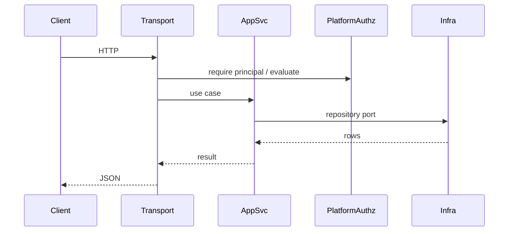
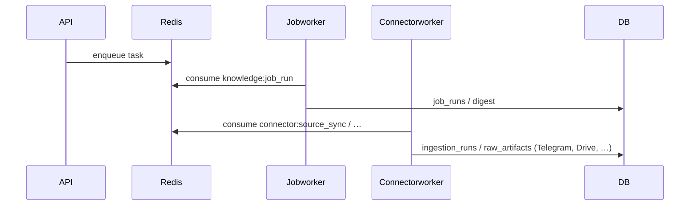

# Backend architecture (`apps/api`)

The production Go backend lives under `[apps/api](../apps/api)` (module `github.com/knowledgelayer/api`). This document is the structural contract for the modular monolith: platform infrastructure, bounded-context modules, and dependency rules.

See also: [MODULE_BOUNDARIES.md](./MODULE_BOUNDARIES.md), [migration-plan.md](./migration-plan.md), [permission-flow.md](./permission-flow.md), [connector-framework.md](./connector-framework.md), [knowledge-jobs-engine.md](./knowledge-jobs-engine.md), [job-builder.md](./job-builder.md).

## 1. Folder structure (target)

```text
apps/api/
  cmd/
    api/              HTTP API
    jobworker/        Asynq: `knowledge:job_run`, `knowledge:scheduled_tick`, `secondbrain:outbound_delivery`
    connectorworker/  Asynq: `connector:source_sync`, `ingestion:process_artifact`, `retrieval:embed_chunk` (embed + upsert), `graphrag:extract_entity`
  internal/
    app/              Composition root (wires platform + modules)
    platform/         Cross-cutting technical infrastructure
      permissions/    Central permission resolver façade
      queue/          Redis / Asynq publisher and task type constants
      config/         (future consolidation from internal/config)
      db/             (migrations remain under internal/db/migrations)
    modules/
      identity_access/
      knowledge_core/
      ingestion_connectors/
      knowledge_jobs/
      retrieval_intelligence/
      governance/
      audit_ops/
        domain/       Models + repository ports
        app/          Application services
        infra/        Postgres / adapter implementations
        transport/    Fiber route registration
    shared/
      contracts/      Minimal cross-module types (keep small)
    httpserver/       Global middleware, mount order, legacy route tables
  internal/db/migrations/
```

Legacy packages (`internal/identity_access`, `internal/audit`, etc.) remain until sliced into `modules/*/…` incrementally.

**Retrieval (v1 foundation):** `internal/chunks` (entity chunk rebuild + enqueue), `internal/embeddings` (pgvector upsert + semantic kNN + permission second stage), `internal/retrieval` (keyword / semantic / hybrid fusion for ask), `internal/llm` (chat + embeddings). `internal/retrieval_intelligence` orchestrates search + retrieval + `qa` and trace persistence.

See [retrieval-ai-foundation.md](./retrieval-ai-foundation.md).

## 2. Module responsibilities


| Module                 | Responsibility                                                    |
| ---------------------- | ----------------------------------------------------------------- |
| identity_access        | Users, teams, roles, domains, grants, access policies, evaluation |
| knowledge_core         | Entities, versions, links                                         |
| ingestion_connectors   | Connectors, feeds, artifacts, sync orchestration                  |
| knowledge_jobs         | Job definitions, triggers, runs, outputs, enqueue                 |
| retrieval_intelligence | Scoped retrieval and ask orchestration                            |
| governance             | Policy exceptions, owners, approval queue, feedback               |
| audit_ops              | Append-only audit events, notification hooks (stubs)              |


## 3. Dependency rules

1. **transport** may depend on **app** (and platform for authz helpers), not directly on concrete repositories.
2. **app** may depend on **domain** (ports), **contracts**, and platform types; not on transport.
3. **infra** implements interfaces defined in **domain** (or app-facing ports); may depend on `pgx`, drivers.
4. **domain** must not import transport, infra, Fiber, or `pgx`.
5. Modules must not import another module’s `infra` or internal implementation packages.
6. Cross-module calls go through **app** services, **shared/contracts**, or explicit platform facades (e.g. `permissions.Resolver`).
7. **Permission resolution** is centralized in `platform/permissions` (wrapping `identity_access.AccessEvaluator`); do not copy grant SQL into feature modules.

## 4. HTTP request flow




## 5. Async flow




- **Knowledge jobs:** `[cmd/jobworker](../apps/api/cmd/jobworker)` handles `knowledge:job_run` and registers a no-op `knowledge:scheduled_tick` handler (see `internal/platform/queue`).
- **Connectors:** `[cmd/connectorworker](../apps/api/cmd/connectorworker)` runs `connector:source_sync` by calling `Ingestion.SyncSourceFeed` (same logic as synchronous API fallback). It also runs `retrieval:embed_chunk` to compute embeddings for `chunks` rows. Remaining task types are stubs until wired.
- **API:** When `REDIS_URL` is set, `POST /source-feeds/:id/sync` returns **202** and enqueues `connector:source_sync`; without Redis it runs sync inline (dev / tests).

## 6. Workers and `internal/`

Go forbids a **separate** module (e.g. repo-root `workers/`) from importing `github.com/knowledgelayer/api/internal/...`. Worker binaries therefore live under `apps/api/cmd/`.